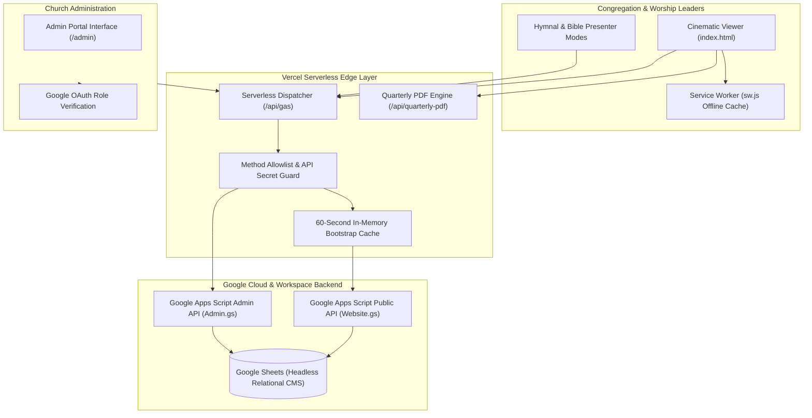

# GMAHK Galilea — Church Web Portal & Progressive Web App

> A production church web portal and liturgy companion engineered with cinematic chapter navigation, offline PWA caching, and serverless Google Apps Script integration.

[](#)
[](https://github.com/zvenians/gmahk-galilea/actions/workflows/ci.yml)
[](https://gmahk-galilea.vercel.app)
[](https://developer.mozilla.org/en-US/docs/Web/Progressive_web_apps)
[](https://vercel.com/)
[](https://developers.google.com/apps-script)
[](#)

---

## 1. Project Overview

The **GMAHK Galilea Web Portal** is the central digital communication and liturgical platform for the Seventh-day Adventist congregation of Galilea in Balikpapan, Indonesia.

It unifies weekly orders of service, morning devotionals (*Renungan Pagi*), scripture readings, hymnals (*Lagu Sion* & *Lagu Tema*), Sabbath School study guides, and community announcements into an editorial, high-performance web experience accessible on any device.

---

## 2. Problem & Solution

### The Problem
During live church services and community outreach:
* **Connectivity Dead Zones:** Mobile signals inside church sanctuaries are frequently unstable or degraded, making traditional heavy web applications slow to load or prone to failure when members attempt to open liturgy schedules or hymn texts.
* **Navigation Friction:** Standard multi-card website layouts are cumbersome to browse quickly during a service when congregants need instantaneous access to a specific hymn or Bible chapter.
* **Content Synchronization Bottlenecks:** Church officers need to update schedules, bulletins, and sermon notes weekly without navigating complex CMS administration interfaces or triggering redeployments.

### The Solution
* **Progressive Web App Architecture:** Engineered with an integrated Service Worker (`sw.js`) that caches core assets, liturgical texts, and hymn libraries, ensuring zero-latency access even when offline or experiencing poor connectivity.
* **Cinematic Chapter Flow:** Replaces traditional fragmented card stacks with five full-screen narrative chapters, title-sequence navigation, and sanctuary light aesthetics.
* **Accessible Typography:** Both light and dark themes rigorously pass WCAG 2.1 AA color contrast tests (minimum 4.5:1 ratio for body text).
* **Headless Google Sheets Engine:** Ministry secretaries maintain schedules directly in Google Sheets; an isolated Vercel serverless proxy (`/api/gas`) caches responses for 60 seconds, protecting backend quotas while reflecting spreadsheet updates automatically.
* **Dedicated Worship Presenter Modes:** Optimized fullscreen reading views for Scripture and Hymnal lyrics designed specifically for pulpit readers and congregation singing.

---

## 3. Visual Previews

| Scripture & Bible Reader | Hymnal & Worship Mode | Weekly Schedule & Calendar |
| :---: | :---: | :---: |
|  |  |  |

---

## 4. System Architecture



### Architecture Highlights
- **Role Isolation:** Public viewer requests execute via a shared proxy identity (`/api/gas`) with a strict method allowlist. The administration workflow executes under the authenticated Google identity to enforce draft, review, and approval permissions.
- **Fail-Safe Resilience:** Client-side fallback handling ensures that cached hymn and schedule records remain readable even if upstream cloud sheets experience intermittent latency.

---

## 5. Key Features

- **5 Visual Narrative Chapters:** Curated opening sequence, weekly schedule, morning devotional, faith broadcasts, and community news.
- **Worship Presenter Suite:** Large-format, distraction-free typography for Bible chapters, *Lagu Sion*, and seasonal theme songs.
- **Full Devotional WhatsApp Sharing:** One-tap sharing of daily *Renungan Pagi* directly to WhatsApp, formatted with scripture references, complete devotional text, and source attribution.
- **Automated Quarterly PDF Generation:** Serverless generation of quarterly worship schedules for printing and offline distribution.
- **Cinematic Admin Portal:** Multi-role administration supporting content drafts, supervisory review/approval, audit logs, and schedule management.
- **Light & Dark Sanctuary Themes:** Ambient lighting transitions engineered with hardware-accelerated CSS and WCAG-compliant contrast ratios.

---

## 6. Technology Stack

- **Frontend:** Semantic HTML5, CSS3 Custom Properties, Vanilla JavaScript (ES6+), Progressive Web App (Service Worker)
- **API Proxy Layer:** Node.js (>=20), Vercel Serverless Functions
- **Backend & Database:** Google Apps Script (V8 Runtime), Google Sheets
- **Document Generation:** PDFKit / Serverless PDF Generator
- **Testing & Quality:** Node.js Test Runner (`node:test`), custom WCAG contrast validator

---

## 7. Project Structure

```text
gmahk-galilea/
├── api/                       # Vercel serverless proxy functions
│   ├── _apps-script.js        # Core Apps Script HTTP bridge
│   ├── gas.js                 # Public viewer API proxy
│   └── quarterly-pdf.js       # Quarterly bulletin PDF generator
├── apps-script-backend/       # Upstream Google Apps Script sources
│   ├── Website.gs             # Public data service & caching
│   ├── Admin.gs               # Multi-role administrative workflows
│   ├── Admins.html            # Cinematic admin portal interface
│   └── VercelApi.gs           # Secure API dispatcher
├── assets/                    # Optimized icons, presentation previews, & branding
│   └── presentation/          # High-resolution showcase preview webp assets
├── docs/                      # Technical manuals & release history
│   ├── CATATAN_RELEASE_V17.md # V17 release notes
│   ├── GALILEA_PROJECT_HANDOFF.md # Project handoff & operations manual
│   ├── HASIL_PENGUJIAN.md     # Build & integrity verification reports
│   ├── PANDUAN_PASANG_VERCEL.md # Vercel deployment instructions
│   └── PANDUAN_UPDATE_V17.md  # Step-by-step viewer update guide
├── index.html                 # Production cinematic viewer single-page application
├── manifest.webmanifest       # PWA web app manifest
├── sw.js                      # Service worker offline caching logic
├── vercel.json                # Vercel routing rules, proxy redirects, & headers
└── package.json               # Node.js project metadata & verification scripts
```

---

## 8. Local Development & Testing

### Verification Suite
To verify proxy allowlists, admin routing, Vercel configuration, Open Graph metadata, and WCAG contrast compliance:

```bash
npm run check
```

### Local Preview
To run the serverless API proxy and viewer locally:

```bash
npx vercel dev
```

Open `http://localhost:3000` in your web browser.

---

## 9. Environment Variables

Configure these variables in your Vercel Project Settings (**Settings > Environment Variables**):

| Variable | Description | Exposure |
| :--- | :--- | :--- |
| `GALILEA_APPS_SCRIPT_API_URL` | Production Google Apps Script Web App URL for public viewer | Server-only |
| `GALILEA_APPS_SCRIPT_ADMIN_URL` | Google Apps Script URL for admin portal execution | Server-only |
| `GALILEA_API_SECRET` | Shared secret header validating requests to the backend dispatcher | Server-only |

---

## 10. Deployment

The project deploys natively to **Vercel**:

```bash
# Production deployment:
npx vercel --prod
```

Upstream spreadsheet updates are automatically synchronized through the proxy cache without requiring a new Vercel deployment.

---

## 11. Additional Documentation

Detailed release notes and operational guides are maintained in [`docs/`](./docs):

- [Release Notes V17](./docs/CATATAN_RELEASE_V17.md)
- [Verification & Integrity Report](./docs/HASIL_PENGUJIAN.md)
- [Vercel Deployment Manual](./docs/PANDUAN_PASANG_VERCEL.md)
- [Viewer Update Guide](./docs/PANDUAN_UPDATE_V17.md)
- [Project Handoff Manual](./docs/GALILEA_PROJECT_HANDOFF.md)

---

## 12. Development & CI Workflow

The project uses GitHub Actions to enforce strict build integrity, proxy allowlist coverage, and accessibility compliance:

```text
Local Branch ──► Pull Request ──► GitHub Actions CI (npm run check) ──► Merge to main ──► Vercel Production
```

- **Local Verification:** Run `npm run check` locally to validate viewer syntax, API proxy routing, Open Graph tags, and WCAG 2.1 AA color contrast.
- **Automated Gating:** Every push and pull request to `main` triggers automated execution of the validation suite.
- **Production Delivery:** Merges to `main` automatically deploy to production on Vercel.


